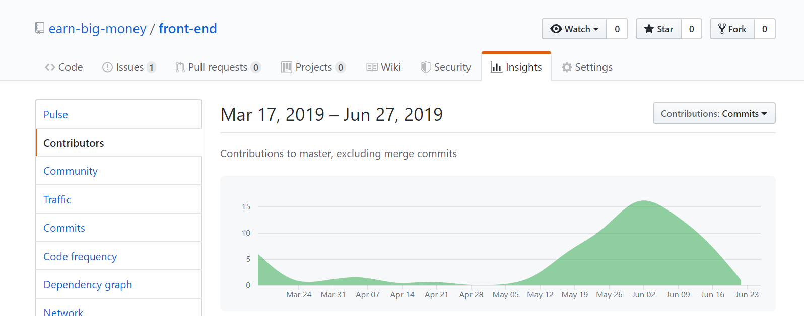
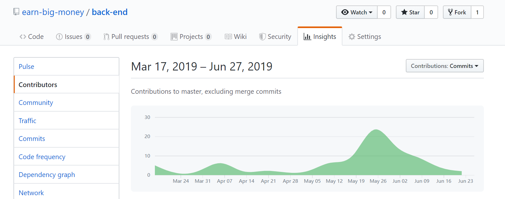
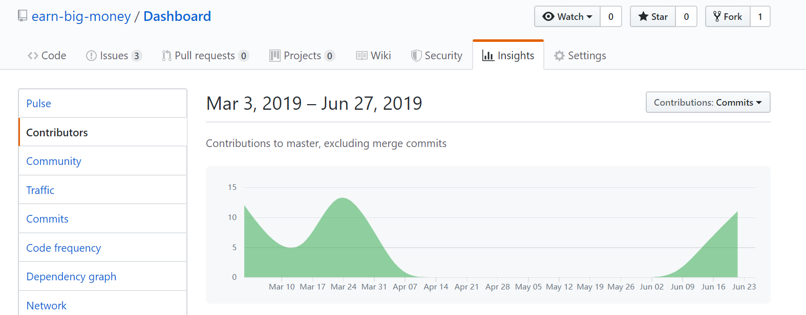
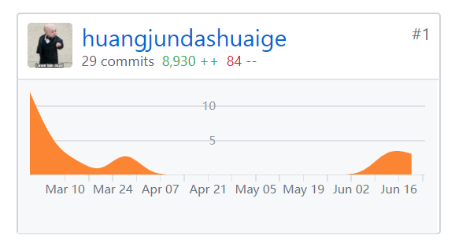
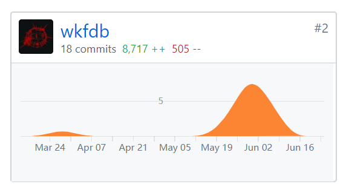
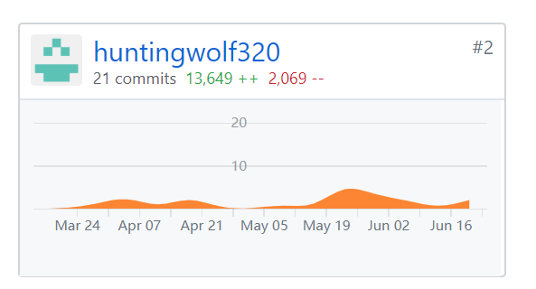
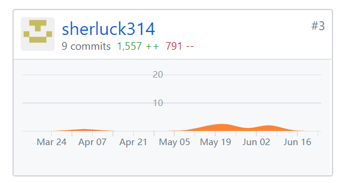

# 综合实训作业提交 check list

本仓库为中山大学 2016 级软件工程，2019春季学期综合实训作业提交 check list。针对课程要求汇总而成的所有需要的文档 [EBM校园任务种包平台](https://120.77.172.46:8080)。

##  1. 写给TA师兄/师姐看

因为我们这次课程的项目要求和 **系统分析与设计** 课程要求的大作业一致，但是文档有很大不同，最关键的一点是因为原先的系统分析与设计课程组队在我们在知道综合实训组队要求的4-8人之前，整个团队已经有9个人了，不符合综合实训的要求。所以原来的团队分成4人和5人的队伍，我们队伍继续把这学期做的**任务种包系统**作为综合实训的作业上交，重新新建了一个org，为的是方便看只有我们四个人的贡献度。另外5人的团队把另一个课程项目作为综合实训的结果上交。如果TA师兄/师姐需要追踪整个项目的commit记录，希望用[系统分析课程项目](https://github.com/earn-big-money) 的repo用于参考，**其中整个项目commit的记录从第四周一直保持到第16周**，我们四个人作为项目的主要代码贡献者，确确实实这个学期花了非常多心思在这个项目之上，希望TA师兄/师姐能够理解我们这个项目并不是把现成的写好的项目直接就交上去，从这个项目的题目也可以知道是这个学期才会写的新项目，我们在贡献率方面已经去除了其他同学的贡献。(如果师兄/师姐对于我们整个项目的真实性和持久性还存在疑问，请务必联系我（qq：715817451），因为这门课是我本科的最后三门课之一，每一分都对我未来的影响非常非常大，请师兄/师姐能够给我一个解释的机会)

为了方便检查，我们把能够真实体现我们持久commit的记录从系统分析的org里面贴出来
- 前端持续commit

    
- 后端持续commit

    
- 需求/设计文档持续commit

    
- 小组个人持续commit记录和commit数量

    - 16350027 @ huangjundashuaige

        
    - 16340218  @ wkfdb

        
    - 16340108 @ huntingwolf320

        
    - 16340212 @ sherluck314

        

1. 安装包与安装部署说明
    - [前端部署说明](./安装包与安装部署说明/前端部署说明.md)
    - [后端部署说明](./安装包与安装部署说明/后端部署说明.md)
2. [用户手册](./使用说明.pdf)
3. 所有源代码
    - [前端源代码](https://github.com/whatsup-sysu/Frontend)
    - [后端源代码](https://github.com/whatsup-sysu/Backend)
4. [软件需求规格说明书(SRS)](./软件需求规格说明书SRS.md)
5. [软件设计文档(SDS)](./软件设计文档SDS.md)
6. [小组分工与贡献率说明](./小组分工与贡献率说明.md)

