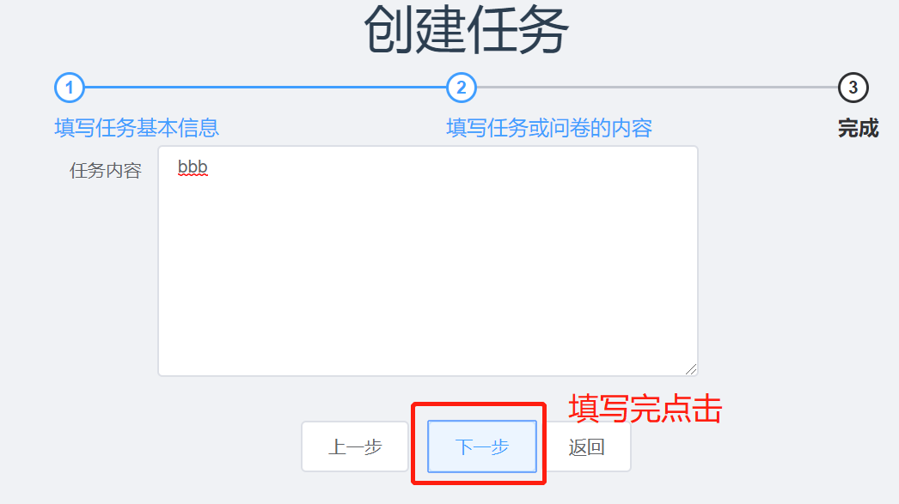

# 使用说明

在浏览器中输入网址：```http://120.77.172.46:8080```，进入网页，功能使用说明如下：  

- 用户登陆注册：  
    当输入网址能够显示网页首页之后，在网页右上角会有两个按钮选择登陆和注册功能，示意图如下：  
      
    根据需求，点击其中一个，即对应进入登陆与注册功能页面。  
    - 登陆：  
        在登陆页面准确填写登陆用到的用户名/邮箱/手机，准确输入用户对应的登陆密码，点击登陆按钮即可登陆，示意图如下：  
        
    
    - 注册：
        在注册页面准确填写完成提示信息，注意昵称/手机号/邮箱/密码的有效性，点击注册即可完成注册功能，示意图如下：  
          

- 充值功能：  
    本功能在个人信息页面中实现。当完成登陆/注册功能之后，可以在首页右上角看到之前登陆和注册的按钮变成了用户头像提示按钮，点击可以进入到个人信息页面：  
      
    在个人页面中，点击充值按钮可以进入到充值对话框中，输入需要的充值金额，点击确认即可完成充值。示意图如下:  
      

- 修改头像：  
    在个人信息页中，点击头像，在弹出来的文档中，选择需要的图片点击确认，即完成了修改头像的功能。此部分功能就不放示意图说明。  

- 参与活动：  
    在首页中，可以看到下方有活动列表，点击其中一个活动列表，即可跳转活动详情页面；在活动详情页面，点击```我要参加```按钮，即可参与活动。示意图如下：  
      
      

- 发布活动：  
    本功能需要已经登陆的用户才能使用。在完成登陆后，点击首页右上角上传的一个logo，即可进入发布活动的页面。示意图如下：  
      
    在发布任务的页面中，按照每个问题的填写好活动信息，点击下一步，填写活动详细信息，点击下一步即完成创建。示意图如下：  
      
      

- 查看已发布与已接受的任务：  
    在个人页面中，可以点击```已发布任务```和```已接受任务```按钮，切换展示与自己相关的任务。示意图如下：  
      
    在已接受任务下面，点击可以选择```已完成任务```即确认自己完成，示意图如下：  
    