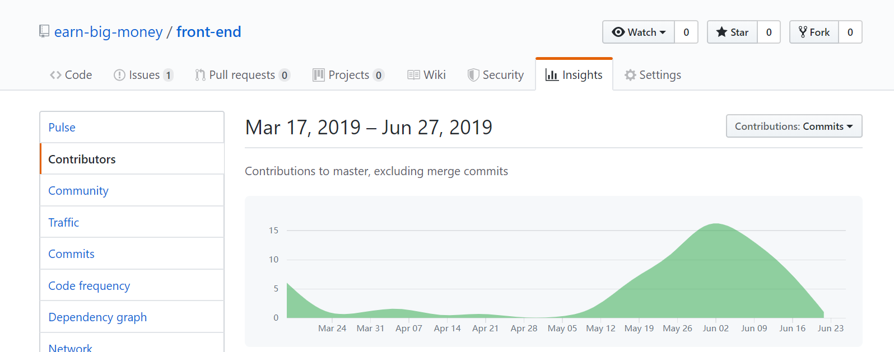
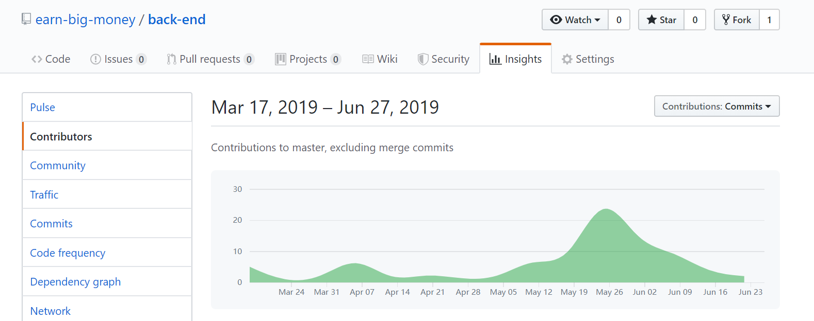

# Final Report

##  1. 写给TA师兄/师姐看

因为我们这次课程的项目要求和 **系统分析与设计** 课程要求的大作业一致，但是文档有很大不同，最关键的一点是因为原先的系统分析与设计课程组队在我们在知道综合实训组队要求的4-8人之前，整个团队已经有9个人了，不符合综合实训的要求。所以原来的团队分成4人和5人的队伍，我们队伍继续把这学期做的**任务种包系统**作为综合实训的作业上交，重新新建了一个org，为的是方便看只有我们四个人的贡献度。另外5人的团队把另一个课程项目作为综合实训的结果上交。如果TA师兄/师姐需要追踪整个项目的commit记录，希望用[系统分析课程项目](https://github.com/earn-big-money) 的repo用于参考，**其中整个项目commit的记录从第四周一直保持到第16周**，我们四个人作为项目的主要代码贡献者，确确实实这个学期花了非常多心思在这个项目之上，希望TA师兄/师姐能够理解我们这个项目并不是把现成的写好的项目直接就交上去，从这个项目的题目也可以知道是这个学期才会写的新项目，我们在贡献率方面已经去除了其他同学的贡献。

为了方便检查，我们把能够真实体现我们持久commit的记录从系统分析的org里面贴出来
- 前端持续commit

    
- 后端持续commit

    
- 需求/设计文档持续commit

    
- 小组个人持续commit记录和commit数量

    - 16350027 @ huangjundashuaige

        
    - 16340218  @ wkfdb

        
    - 16340108 @ huntingwolf320

        
    - 16340212 @ sherluck314

        

## 小组分工与贡献率

|学号|昵称|Github|岗位角色|贡献率(合计100%)|
|:--:|:--:|:--:|:--:|:--:|
|16350027|huangjundashuaige|[huangjundashuaige](https://github.com/orgs/whatsup-sysu/people/huangjundashuaige)|项目经理、UI工程师|25%|
|16340218|wkfdb|[wkfdb](https://github.com/orgs/whatsup-sysu/people/wkfdb)|技术经理、js工程师|25%|
|16340108|huntingwolf320|[huntingwolf320](https://github.com/orgs/whatsup-sysu/people/huntingwolf320)|后台工程师、API设计师|25%|
|16340212|sherluck314|[sherluck314](https://github.com/orgs/whatsup-sysu/people/sherluck314)|后台工程师、测试工程师|25%|

* 管理岗：项目经理
* 技术岗：架构师（技术经理）、js工程师、UI/UX设计师、后台工程师、数据库DBA等
* 质量岗：QA 测试工程师

## 制品与贡献率

| 制品       |   工作内容    | huangjundashuaige | wkfdb | huntingwolf320 | sherluck314 | 
| ---------- | ------------------------------------------------------------ | ---- | ------ | ------ | ------ |
| 源代码     | 项目代码。 [source_code](https://github.com/whatsup-sysu)| 15% | 30% | 25%    | 30%    |
| 项目文档   | [文档](https://github.com/whatsup-sysu/documents)             | 30% | 10% | 15%   | 45%     |
| 分析与设计 | UI设计/数据库设计/api设计/架构设计                              | 30% | 30% | 30%   | 10%    |
| 需求/测试| 前期调研/正确性测试/压力测试                                      | 25% | 30% | 30%   | 15%         |
| 综合贡献   |                                                              | 25%  | 25% | 25%    | 25%    |

## 小组成员

|   学号   |  姓名  |           GitHub账号            |
| :------: | :----: | :-----------------------------: |
| 16350027 |  huangjundashuaige  |  https://github.com/huangjundashuaige  |
| 16340218 | wkfdb | https://github.com/wkfdb  |
| 16340108 | huntingwolf320 | https://github.com/huntingwolf320 |
| 16340212 | sherluck314 | https://github.com/sherluck314  |

## PSP2.1 汇总表

|      项目    | huangjundashuaige | wkfdb | huntingwolf320 | sherluck314 |
| :------------: | :--: | :----: | :----: | :----: |
|      计划    |   24   |   11   |    20    |   10  |
| * 估计任务时间 |   24  |   11   |    10    |    12    |
|      开发      |   62   |   84   |    70    |   80     |
|   * 分析需求   |   24   |   10   |    10    |   12     |
| * 生成设计文档 |   12   |   5    |    30    |    8    |
|   * 设计复审   |   8   |   2   |    8    |    3    |
|   * 代码规范   |   6   |   2    |    4   |    6    |
|   * 具体设计   |    12  |   8   |    8    |    8    |
|    * 具体编码     |   6   | 30 |    20   |     25      |
|   * 代码复审   |   0   |   7   |    10    |    3    |
|    * 测试      |   0   |   20   |    15    |   15     |
|    报告        |  14   | 5 |  10    |   10    |
|   * 测试报告   |   0   | 2 |    3    |   5     |
|  * 计算工作量  |   2   | 1 |    1    |    3    |
|  * 事后总结    |   12   | 2 |     6   |   2   |
| 合计 | 100 | 100 | 100 | 100 |
