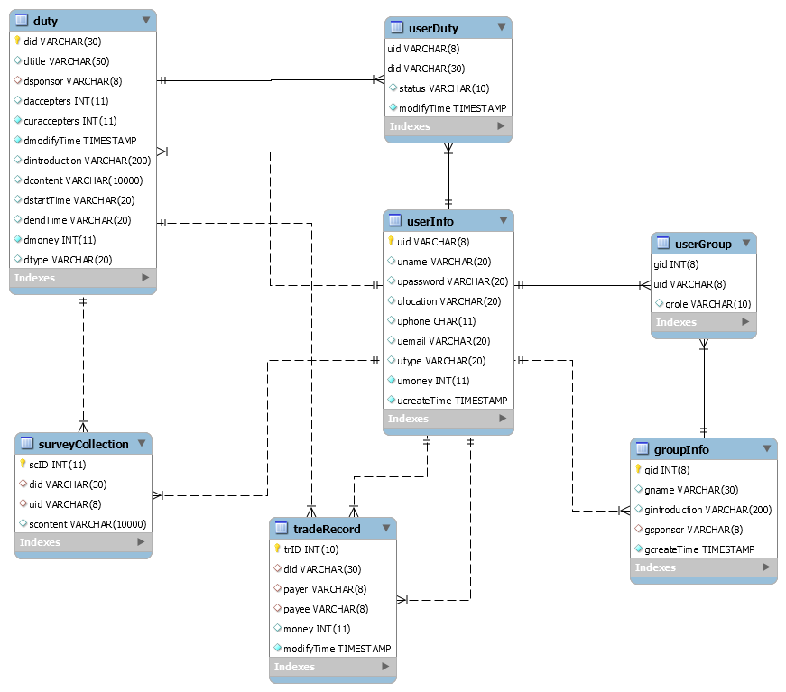
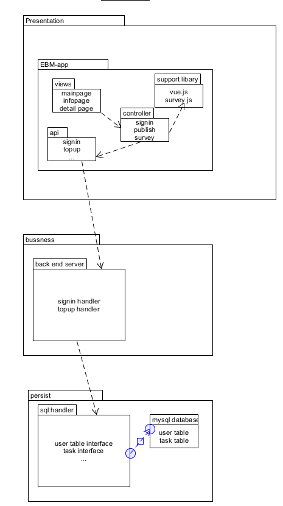
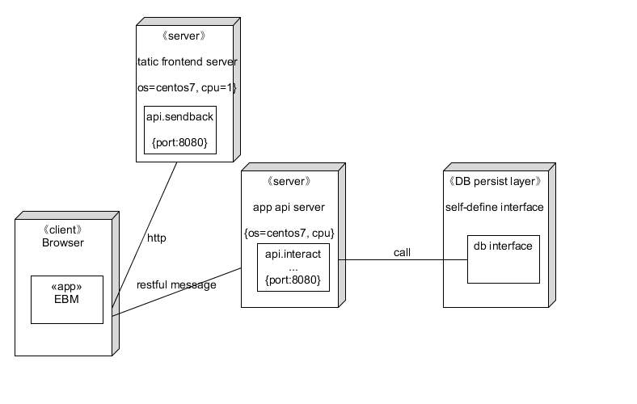
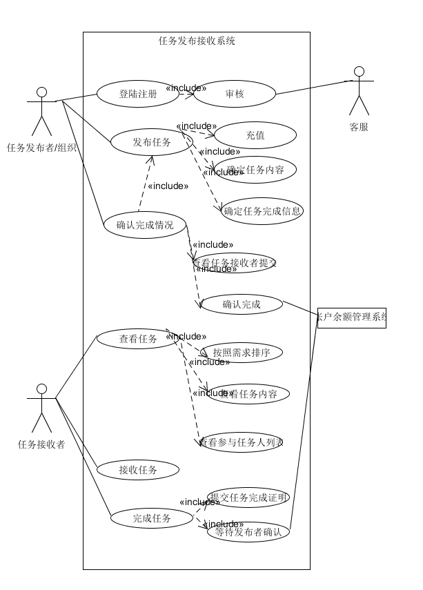
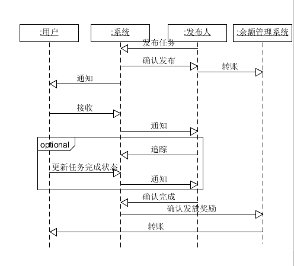
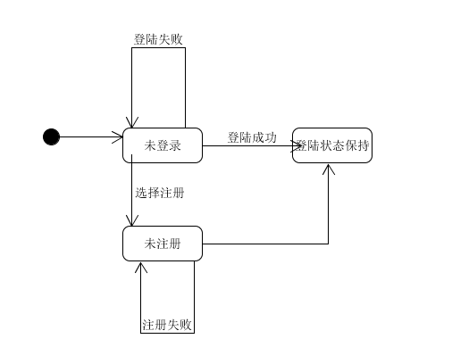
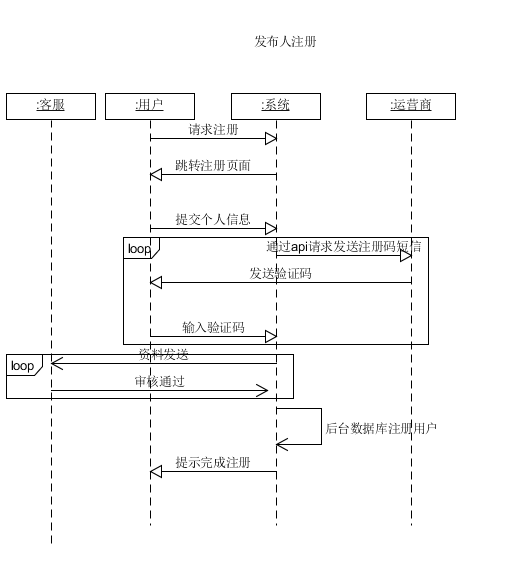
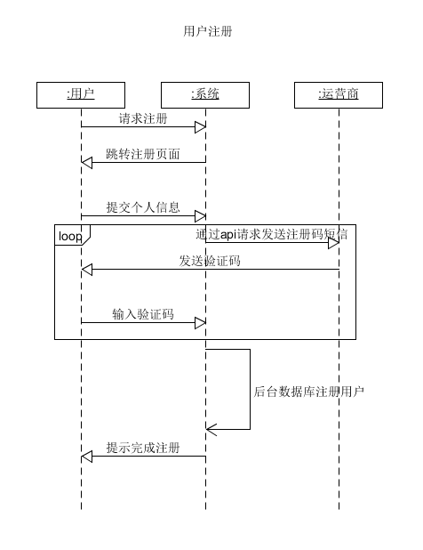

<!-- vscode-markdown-toc -->
* 1. [UI设计文档](#UI)
* 2. [数据库模式设计](#)
* 3. [API设计](#API)
* 4. [用户注册](#-1)
	* 4.1. [参数说明](#-1)
	* 4.2. [返回值](#-1)
	* 4.3. [示例](#-1)
* 5. [用户登录](#-1)
	* 5.1. [参数说明](#-1)
	* 5.2. [返回值](#-1)
	* 5.3. [1. 前端api文档](#api)
	* 5.4. [2. 后端api文档](#api-1)
* 6. [软件架构设计](#-1)
	* 6.1. [1. 软件架构的逻辑视图](#-1)
	* 6.2. [2. 软件架构的物理视图](#-1)
	* 6.3. [部署细节](#-1)
		* 6.3.1. [前端部署说明](#-1)
		* 6.3.2. [前端文件目录](#-1)
		* 6.3.3. [后端源码目录以及说明](#-1)
* 7. [用例设计](#-1)
		* 7.1. [用例文本与活动图](#-1)
	* 7.1. [1.发布和接收任务](#-1)
	* 7.2. [2.登陆注册](#-1)

<!-- vscode-markdown-toc-config
	numbering=true
	autoSave=true
	/vscode-markdown-toc-config -->
<!-- /vscode-markdown-toc -->

# 软件设计文档

##  1. <a name='UI'></a>UI设计文档

    廖磊负责

##  2. <a name=''></a>数据库模式设计
这里包含了系统基础框架所需的完整数据库设计。 




我们并没有对于权限进行设计，而是直接把用户和发布人的功能进行不同的划分，能够调用的api不同，而不是相同的api所能执行的功能因为权限不同而产生不同的效果。

##  3. <a name='API'></a>API设计

采用了前后端分离的api设计，因为api太多所以只列了作为样例的几个。

##  4. <a name='-1'></a>用户注册

`POST /user`

由于需要上传文件，要求使用`multipart/form-data`提交请求。

###  4.1. <a name='-1'></a>参数说明

| 参数名   | 数据类型               | 描述     | 必需 |
| -------- | ---------------------- | -------- | ---- |
| email    | string                 | 注册邮箱 | 是   |
| password | string                 | 密码     | 是   |
| name     | string                 | 用户名   | 是   |
| license(optional)  | file（docx、doc、pdf） | 组织证明 | 是   |

###  4.2. <a name='-1'></a>返回值

| HTTP状态码 | 返回格式            | 描述       |
| ---------- | ------------------- | ---------- |
| 200        | NULL                | 成功       |
| 400        | {message: 'reason'} | 错误的请求 |

###  4.3. <a name='-1'></a>示例

```js
const form = new FormData();
form.append('email', info.email);
form.append('name', info.name);
form.append('password', info.password);
form.append('license', info.license, 'a.docx');
axios.post('/restaurant', form, {
  headers: form.getHeaders()
});
```

##  5. <a name='-1'></a>用户登录

`POST /customer/session`

调用此API后，如果用户没有注册，则会自动注册并登录；如果用户已经注册，则完成登录。

###  5.1. <a name='-1'></a>参数说明

| 参数名 | 数据类型 | 描述         | 必须 |
| ------ | -------- | ------------ | ---- |
| code   | string   | 登录凭证 | 是   |

###  5.2. <a name='-1'></a>返回值

| HTTP状态码 | 返回格式            | 描述       |
| ---------- | ------------------- | ---------- |
| 200        | NULL                | 成功       |
| 400        | {message: 'reason'} | 错误的请求 |


###  5.3. <a name='api'></a>1. 前端api文档
    [前端api文档](https://documenter.getpostman.com/view/7355822/S1TVXyAV?version=latest#f651b449-dbaa-4758-bab2-cdf4b1acf71b)

###  5.4. <a name='api-1'></a>2. 后端api文档
    [后端api文档](https://documenter.getpostman.com/view/7355822/S1TZzbyN?version=latest)

##  6. <a name='-1'></a>软件架构设计

###  6.1. <a name='-1'></a>1. 软件架构的逻辑视图



架构是前后端分离，前端发放服务器和后端交互服务器分离，其中用restful-like api进行交互。用mysql作为持久化层。

前端的模式为mvc模式，其中使用到的外部支持库有编辑调查表的survey.js

###  6.2. <a name='-1'></a>2. 软件架构的物理视图



架构的物理层架构，分别分成了前端用户的浏览器访问端，从静态服务器中获取前端文件，用restful的方式从api服务器去进行交互，其中涉及到持久层的交互由与mysql dbrs完成。


###  6.3. <a name='-1'></a>部署细节

####  6.3.1. <a name='-1'></a>前端部署说明

##### 使用cnpm安装的部分均可用npm安装替代。使用cnpm是因为cnpm使用国内镜像资源，下载安装依赖包较块。

1. cnpm install -g vue-cli（前端依靠vue来实现，所以在运行项目之前，首先要安装vue）
2. cd Frontend/whatsup（进入项目文件夹，在这里运行项目启动命令）
3. cnpm install（一键安装项目运行所需要的所有依赖包）
4. npm run dev（项目启动，浏览器自动跳出页面）

##### npm以及cnpm安装方式

cnpm解决了国内某些依赖包使用npm无法安装或者安装过慢的问题。在安装cnpm之前，首先要确保安装了npm。

- npm安装

1. 根据自己的操作系统，首先前往nodejs官网[下载nodejs](http://nodejs.cn/download/) 

2. 然后点击安装，选择自己要安装的路径，此处我选择的是：**D:\Program Files\nodejs**，一路next，安装至完成。 

3. **window+R**,输入**cmd**,打开命令提示符窗口，输入：`npm -v` 检测是否安装成功。

4. 配置npm的全局模块的存放路径、cache的路径，此处我选择放在：**D:\Program Files\nodejs** 

   输入如下命令：

   ```
   npm config set prefix "D:\Program Files\nodejs\node_global"
   npm config set cache"D:\Program Files\nodejs\node_cache"
   ```

5. 在系统环境变量添加NODE_PATH,输入路径为： D:\Program Files\nodejs\node_global 
   操作如下：我的电脑右击，打开属性->高级系统设置->环境变量->新建（系统变量下）->输入变量名NODE_PATH->变量值：输入上面路径，确定即可。 

- cnpm安装

1. 安装cnpm，输入以下命令：

   ```
   npm install -g cnpm --registry=https://registry.npm.taobao.org
   ```

2. 添加系统变量path的内容 。因为cnpm会被安装到D:\Program Files\nodejs\node_global下，而系统变量path并未包含该路径。在系统变量path下添加该路径即可正常使用cnpm。 

3. 输入`cnpm-v`检测是否安装成功。

####  6.3.2. <a name='-1'></a>前端文件目录

- front-end
  - build:  webpack文件，配置参数,打包的代码存放在这里，自动生成
  - config:  vue项目的基本配置文件，自动生成
  - node_modules: 存放项目中使用的各种npm包，cnpm/npm install后生成
  - src: 项目源文件存放地址，包含前端页面，路径配置，静态资源等
    - assets：存放前端页面用到的各种静态资源
    - components：存放前端的各个vue页面
    - router：存放前端页面的路径配置文件
    - App.vue：VUE demo演示页面的启动组件
    - main.js：该模块页面的初始化js
  - static：项目静态资源目录
  - test：测试文件，初始化测试都写在这里,可以删除
  - .babelrc ：babel编译参数，vue开发需要babel编译
  - .editorconfig：代码编辑环境配置文件
  - .gitignore：设置git忽略文件
  - .postcssrc.js：css配置文件,自动补齐浏览器css前缀
  - index.html：主页，项目入口文件
  - package.json：项目配置文件，描述项目信息和依赖
  - README.md ：项目的说明文档，markdown 格式
  - run.bat：Windows批处理文件，运行项目时生成

####  6.3.3. <a name='-1'></a>后端源码目录以及说明
##### 项目代码  
https://github.com/whatsup-sysu/Backend

##### 代码说明
- src
  - bin: 执行程序
  - controllor:  控制器目录
    - DBController_public.js:数据库接口
    - userSystem_public.js:用户系统，登录注册等
    - dutySystem_public.js:任务系统，发布接受等
    - tradeSystem_public.js:交易系统，转账充值等
    - surveySystem_public.js:问卷调查相关
    - imageSystem_public.js:图片资源上传下载
    - utils_public:公共模块
    - validator.js:正则校验
  - database: 数据库管理
    - Config：数据表及配置信息
    - DataBaseMySQL：数据库连接管理
  - routes：路由分级处理
    - users.js 
    - dities.js
    - photo.js
    - survey.js
    - trades.js
    - survey.js
  - sessions：保存后端与前端的会话状态
  - upload：保存用户上传的资源信息
  - app.js ：express程序执行入口
  - package.json：项目配置文件，描述项目信息和依赖

###### 测试文档  
附文件《后端API测试报告》


##  7. <a name='-1'></a>用例设计

####  7.1. <a name='-1'></a>用例文本与活动图

总用例框图


一共分为两个用例，一个是发布和接受任务，一个是登陆和注册。
###  7.1. <a name='-1'></a>1.发布和接收任务
BCE模式下的ssd如下




状态图如下



###  7.2. <a name='-1'></a>2.登陆注册

BCE模式下的ssd如下




状态图如下

用户的注册登陆



发布人的注册登陆

