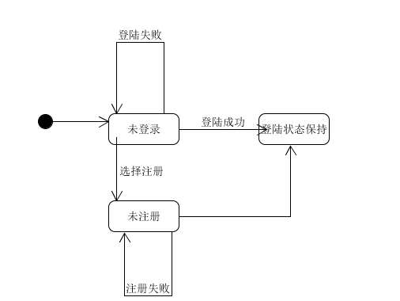
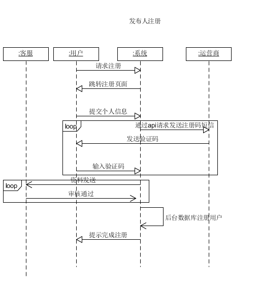

<!-- vscode-markdown-toc -->
* 1. [1.1. 引言](#)
	* 1.1. [1.1.1. 编写目的](#-1)
	* 1.2. [1.1.2. 背景](#-1)
* 2. [1.2. 项目前期调研](#-1)
	* 2.1. [1.2.1. 背景](#-1)
	* 2.2. [1.2.2. 用户调研](#-1)
	* 2.3. [1.2.3. 用户调研目的概述](#-1)
	* 2.4. [1.2.4. 调研对象和方法](#-1)
	* 2.5. [1.2.5. 调研过程](#-1)
		* 2.5.1. [1.2.5.1. 访谈对象1-学生团体负责人：](#-1)
		* 2.5.2. [1.2.5.2. 访谈对象2-在校大学生：](#-1)
	* 2.6. [1.2.6. 调研总结](#-1)
* 3. [1.3. 竞品分析](#-1)
	* 3.1. [1.3.1. 咸鱼](#-1)
	* 3.2. [1.3.2. 产品概要](#-1)
* 4. [1.4. 需求规格说明](#-1)
	* 4.1. [1.4.1. 用例图](#-1)
		* 4.1.1. [1.4.1.1. 用例文本与活动图](#-1)
		* 4.1.2. [1.4.1.2. 领域模型](#-1)

<!-- vscode-markdown-toc-config
	numbering=true
	autoSave=true
	/vscode-markdown-toc-config -->
<!-- /vscode-markdown-toc -->
# 1. 软件需求规格说明 SRS
##  1. 1.1. 引言

###  1.1. 1.1.1. 编写目的

​	软件需求说明是需求分析阶段的一个文档，是对软件目标及范围的求精和细化，深入描述软件功能及软件的约束范围，使用户和软件开发者对该软件的初始的规定有个大概的了解，有利于对项目的回溯和知道后续的开发和维护

###  1.2. 1.1.2. 背景
说明：

1. 这个项目同时作为系统分析与设计课程和软件工程综合实训的课程作业
2. 之所以选取实现这个项目的原因是因为系统分析课程推荐的项目
3. 项目的最终目的是希望能够实现在校园范围内的工作种包

##  2. 1.2. 项目前期调研

###  2.1. 1.2.1. 背景
在大学生日常生活中，许多事情可以通过互联网与智能手机变得更加方便，例如在网上发布问卷进行调研，
请人帮拿外卖等等。同时，大学生平时也有不少零碎的空余时间，可以利用这些时间来挣一下闲钱。
因此，为大学生提供一个服务平台--挣闲钱系统，可以有效地帮助大学生发布任务和做任务挣钱，
针对这个系统，我们开展了项目调研。

###  2.2. 1.2.2. 用户调研

###  2.3. 1.2.3. 用户调研目的概述
本次用户调研是对“挣闲钱”项目进行的一次用户调研。主要目的为确认项目在目标主要人群的接受度。从以下几个方面了解
1. 对于学生团体负责人，关注他们是否有活动的宣传和组织需求；对于普通大学生，主要了解他们是否愿意利用空余时间挣闲钱，是否有发布任务的需求 
2. 是否有用过或了解过类似挣闲钱的服务平台
3. 是否会使用挣闲钱服务平台
4. 关于项目的印象或建议。 

###  2.4. 1.2.4. 调研对象和方法
本次用户调研的目标人群也是项目的的目标人群，主要是大学生。调研采用用户访谈和小组访谈的方式对一些大学生和小组人员进行三个方面的访谈和讨论。

###  2.5. 1.2.5. 调研过程

####  2.5.1. 1.2.5.1. 访谈对象1-学生团体负责人：

Q：是否有因为举办一些活动而需要别人帮助的情况（如：填写问卷等）。  
A：有啊，之前有一次活动需要做问卷调查收集信息，转发了很多个群才收集到了足够的问卷。  
Q：那你希望有一个平台能够帮你把需求发布让别人来帮助你吗？比如说你发布问卷来让别人填写。  
A：那肯定希望有啊。  
Q：你有使用过类似的平台或软件吗
A：我用过问卷星来收集问卷，但是这需要向各个群发布问卷链接。
Q：那如果这种帮助是收费的话你还会使用吗？  
A：看价格吧，不贵的话应该会用，我去那些群里发问卷也要发红包的。  
Q：那你觉得这样一个平台有什么需要注意的地方吗？  
A:有啊，比如说我要求填问卷的人是大学生，那就应该只有大学生能填写这份问卷；还有就是受众要足够吧，比如说我要调查一个学校的学生，但是平台上的用户只有一个专业的学生。  

####  2.5.2. 1.2.5.2. 访谈对象2-在校大学生：

Q：请问平时有想过自己挣一些零花钱的想法吗？  
A：有啊，但是基本没有什么渠道。  
Q：那如果有一个平台平时会发布一些挣零花钱的任务，比如说帮别人填写一些调查问卷等，你会愿意去做吗？   
A：考虑性价比吧，如果我觉得性价比可以的话能挣点零花钱还是挺不错的。  
Q：那你有使用过类似的软件吗？  
A：没有。  
Q：对于这样一个平台你认为有什么需要改进的吗
A：我觉得如果有一些社团，组织来发布任务的话会更吸引我。

###  2.6. 1.2.6. 调研总结
1. 很多的社团干事在组织活动时需要一个平台来宣发组织活动，发布问卷的需求很大。普通学生愿意利用空余时间挣闲钱。
2. 市场上类似的平台或软件较少，一些功能无法满足需求。
3. 大部分用户表示会去了解“挣闲钱”项目，但会根据最终的产品决定是否使用。会使用项目的同学表示机构组织问卷调查这一功能十分有用，有很多同学有发布问卷的需求，但通常是在微信群等组织中发布，很不方便。对项目不感兴趣的用户表示项目功能太少，认为没有必要使用。  
4. 许多人认为“挣闲钱”项目的用户数量很重要，有的人建议关注社团、公司等组织的需求来带动普通用户的使用。  

##  3. 1.3. 竞品分析

###  3.1. 1.3.1. 咸鱼

作为一个任务发布和出卖二手产品的app，最具有知名度的app当属咸鱼了

首先咸鱼与众不同的一个地方就在于它一开始定位也是作为一个和淘宝一样的网站，但是之后的策略却撤销了之后把所有功能和服务都限制上只能通过app的入口来进行操作。

这样的做法很难说是对是错，但是之所以咸鱼能够成功的地方就是在于当时阿里巴巴的体量之大对于二手交易能够有很强的第三方交易保证和流量，导致了咸鱼在二手交易领域上占有绝对的主导地位，所以在于网页还是app的入口的选择上完全不用考虑用户的流失。

说回咸鱼的功能，咸鱼其实对于二手商品的类别并没有什么要求，咸鱼所提供的功能只是基础的发布和购买，以及买家与卖家沟通的一个途径。好处就是整个app的交互逻辑和整体性非常好，但是坏处就是在管理方面存在一定的缺陷比如可能涉及到违法的二手交易如何处理还是一个问题。

咸鱼值得借鉴的地方就在于能够通过非常简洁的交互逻辑来使用，同时泛化了很多功能，导致整个app轻量化。值得改进的地方就是能够建立在简单的发布购买逻辑之上再加入我们所需要的特定的指派任务和问卷填写的直接支持，而不是需要第三方的支持。

 

##  4. 1.4. 需求规格说明
###  4.1. 1.4.1. 用例图
下图为整个系统的用例一览。

####  4.1.1. 1.4.1.1. 用例文本与活动图

总用例图

下面是活动图。

####  4.1.2. 1.4.1.2. 领域模型

对于软件中涉及到的实体的属性和实体之间的关系和限制进行需求建模

##### 1.4.1.2.1. 实体说明

其中最主要的实体是以任务为中心的，任务本身，发布任务的发布人，接受任务的用户

###### 1.4.1.2.1.1. 任务本身
    任务本身分为详细任务的信息和缩略的信息，其中缩略的任务是对于详细的任务的一个简化，就是只保留了其中一些有代表性的属性
###### 1.4.1.2.1.2. 发布任务的发布人
    虽然发布人和接受人都是用户，登陆的方式一样，但是不一样的是体现出来的权限不一样，审核的过程也不一样，所需要提交的信息不同，对应的属性不同。
###### 1.4.1.2.1.3. 接受人
    相当于发布人来说接受的人的审核过程较为简单，只需要对于个人的身份达到一个验证就可以了
##### 1.4.1.2.2. 实体及关系说明
###### 1.4.1.2.2.1. 任务与发布人的关系
    一个发布人和以同时发布多个任务，只要余额充足
###### 1.4.1.2.2.2. 任务和接收人关系
    一个接受人可以同时几首多个任务

##### 1.4.1.2.3. 状态图
    

1. 用户可能涉及到的状态

2. 任务涉及到的状态

##### 1.4.1.2.4. SSD 交互顺序图（最重要的coding参考）

1. 总的逻辑顺序交互

2. 用户注册交互

3. 发布人注册交互

